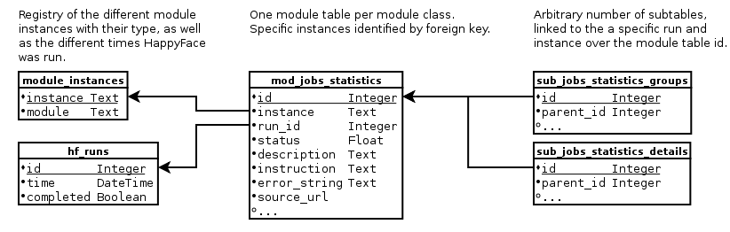

.. _module-dev:

******************
Module Development
******************

Modules are the building blocks that give HappyFace its functionality. Specifically, they
 1) download and parse data to store it in a database
 2) retrieve data from a database and render it to HTML

These actions are represented by the :mod:`render.py` and :mod:`acquire.py` entry scripts. In order to do their work, they need to interact with the core of HappyFace and have to obey the rules for modules, otherwise the functionality of external tools and HappyFace itself can be disturbed.

Module Basics
=============
The module source code is located somewhere within the modules directory of the HappyFace setup, by default it is just the modules/ subdirectory. At startup, everything inside this directory and any subdirectory that looks like a python module is imported and module wide source code is executed.

In one of these files is the source code of our example module. The module itself is a class derived from :class:`hf.module.ModuleBase` that must implement a certain subset of methods, as well as specify a set of class-level variables describing configuration and database layout

Additionally, a HTML template file with the same name as the class is expected along with the file the class is in. This template contains the formatting information for the web output.

.. _database_layout:

Database Layout
---------------

Associated with each module is a so called module table in the database and an arbitrary number of subtables.

One entry is added to the module table every time :mod:`acquire.py` is called. By default, it contains the only a minimal set of columns, but can be extended with the :data:`table_columns` variable in the module definition. For the module developer, the following columns are of interest

 term status
    A numerical value. Its meaning is as follows
     * 0.66 <= status <= 1.0  The module is happy/normal operation
     * 0.33 <= status < 0.66  Neutral, there are things going wrong slightly.
     * 0.0  <= status < 0.33  Unhappy, something is very wrong with the monitored modules
     * status = -1            An error occured during module execution
     * status = -2            Data could not be retrieved (download failed etc.)

 next term source_url
    An URL to the data source, if applicable. At the moment only a single URL can be specified, this is to be regarded as a current limitation of HappyFace.

.. _mod-dev-subtable:

Subtable System
^^^^^^^^^^^^^^^
Often you want to store more data than just a single, fixed entry in the database per run. For this the so called subtable mechanism is used. For each module, you can specify an arbitrary number of subtables. Each entry in them is linked to an entry in the module table. By this, the data is in the subtable is uniquely identified to a point in time and a specific module instance.

HappyFace cannot provide you much help for filling the subtables and inserting the data into the template namespace. For that reason you have to use the sqlachemy API to insert and select the data.

The following graph is a schematic overview over the relations between the main HappyFace database registry, the module tables and subtables. Only the columns common for all module and subtables are shown. In reality, there are user defined columns for module and subtables containing the actual data.
    

.. _mod-dev-smart_filling:

Smart Database Filling
^^^^^^^^^^^^^^^^^^^^^^

Sometimes you encounter situations where you want a module to store *a lot* of information that only changes once in a while. For example, we weekly generate an overview of the stored files in our computing site. Obviously, this is a lot of data you don't want to store quarter hourly.

To avoid rewriting detailed data in subtables, the smart filling mechanism can be used. It is an easy way to tell HappyFace whether or not subtable data shall be stored. In order to correctly display the module, one has the keep track when detailed information was stored last.

In order to use smart filling, set the :ref:`class-level variable <mod-dev-classvars>` :dat:`use_smart_filling` to *True*.

.. code-block:: python

 class MyModule(hf.module.ModuleBase):
     use_smart_filling = True
     # [...]

Internaly, HappyFace will then add another column named *sf_data_id* to the module table, pointing to the actual data, but this should be of no direct concern for module developers.

When smart filling is used, the two attributes :attr:`smart_filling_current_dataset <hf.module.ModuleBase.smart_filling_current_dataset>` and :attr:`smart_filling_keep_data <hf.module.ModuleBase.smart_filling_keep_data>` are available.

Example
-------
A minimalistic, working example of a Python module is presented here

.. code-block:: python

 # Module Definition
 import hf
 from sqlalchemy import *
 
 class Dummy(hf.module.ModuleBase):
     config_keys = {'test': ('A config variable that is directly passed into the database', '')}
     table_columns = [Column('test',  INT)], []
 
     def extractData(self):
         return {
             "status": '',
             "test": int(self.config['test'])
         }

.. code-block:: html

 ## HTML Template
 <%inherit file="/module_base.html" />
 
 <%def name="content()">
 
${dataset['test']}

 </%def>

A detailed description of the module class variables and methods are found in the next section. The `Mako Templating Engine <http://http://www.makotemplates.org/>`_ is used for parsing the HTML template, please consult the Mako Documentation for more information about the syntax.

Module Class Reference
======================
The module class is derived from :class:`hf.module.ModuleBase` and the naming should be CamelCased. For the database table names, the CamelCase name is converted to camel_case.

Any class defiving from :class:`hf.module.ModuleBase` found in the modules directory somewhere is considered a HappyFace module. It is then checked if 

.. _mod-dev-classvars:

Special Class Variables
-----------------------
HappyFace makes use of class wide variables to define several aspects of the module.

.. data:: config_keys

    *required*

    A dictionary where the keys correspond to module specific keys in the configuration file and the value is a tuple of two strings. The first string is a description of the variable and the second one a string with the default value (e.g. empty string).

    This is used by the :mod:`hf.tools.modconfig` to generate empty configurations for a module.

.. data:: config_hint

    *optional*

    A plain string with general information about the configuration of the module. Used by :mod:`hf.tools.modconfig` where it is put at the top of the automatically generated configuration, if specified.

.. data:: table_columns

    *required*

    A tuple with two lists in it.
    1) A list of sqlalchemy Column objects. These columns are added to the module table and usually suffice for the module operation
    2) A list of strings, they are the names of columns in the module table that point to files in the archive directory.

.. data:: subtable_columns

    *optional*

    A dictionary where the key is the name of the subtable, e.g. *details*, and the values are tuples like :data:`table_colums`. They are the data columns for the subtable and the corresponding archive links. For more information about subtables, see :ref:`mod-dev-subtable`
    
    The subtable names are not passed to the database as they are, but are prepended with the module name to ensure uniqueness. Therefore, two modules can use the same subtable name without problems.

    The resulting Table objects can be accessed via the :attr:`hf.module.ModuleBase.subtables` dictionary.

.. data:: use_smart_filling

    *optional*

    Set to *True* if you want to enable :ref:`smart filling <mod-dev-smart_filling>` on the module.

Class Methods
-------------
:class:`hf.module.ModuleBase` does provide several convenience functions that are used when the HTML weboutput is created, as well as default implementations for some optional actions the module can perform. The functions are called during different steps of the HappyFace acquire and render run and perform specific actions.

In total, you must implement at least one method, :meth:`hf.module.ModuleBase.extractData`, to populate the database and optionally, a set of the following methods

* :meth:`prepareAcquisition() <hf.module.ModuleBase.prepareAcquisition>`
* :meth:`fillSubtables() <hf.module.ModuleBase.fillSubtables>`
* :meth:`getTemplateData() <hf.module.ModuleBase.getTemplateData>`

Please refer to the linked documentation of :class:`hf.module.ModuleBase` and the :ref:`mod-dev-step-guide`. for implementation details 

HTML Templates, Generating Output
=================================

By now we acquired data, stored them into the database and maybe wrote a function to retrieve data from the database again. To actually display something on the HappyFace weboutput, you need to create an HTML template first.

Internally, the `Mako Template Engine <http://www.makotemplates.org/>`_ is used interpolate the data into the template.

In short, all data is filled in the template with a pattern looking like *${* **expression** *}*, where expression is a piece of Python code returning a value. By default, the expression is converted to a unicode string, if it isn't already, and then HTML special character escaping is performed. This results e.g. in the replacement of **&** to **&amp;**. If you do not want these default filters applied, to can disable them with the *n* filter as described in the `documentation. <http://docs.makotemplates.org/en/latest/filtering.html#turning-off-filtering-with-the-n-filter>`_ In that case, you need to take care of applying the filters yourself.

Useful data is stored in template wide variables. By default, the following variables are available, although you usually only need few of them.

*hf*
    The HappyFace namespace, refer to the :ref:`Core documentation <core>` for an overview. Usually, you only need functions from :mod:`hf.utility` or :mod:`hf.url`.

*module*
    The module object of the current instance.

*data_stale*
    A flag that indicates if the data is stale, meaning it is older than a certain time threshold.

*run*
    The run dictionary with the information about the current run.

*dataset*
    Often the only variable you need. It is the data in the module table from the current run. This is the data you probably want to display.

The template namespace is extended by the dictionary returned by :meth:`getTemplateData() <hf.module.ModuleBase.getTemplateData>`. So if you return a dictionary with the key *super_special_data*, the variable in the template with the same name has the value of the key in the dictionary.

.. todo:: Include information about CSS and JavaScript.

Using Matplotlib
================

Sometimes you don't want to display raw, numerical data but instead generate a nice plot from your data. Matplotlib is the common choise for this in Python and is used by the internal plot generator.

If you want to use Matplotlib in one of your modules, you must not include *pyplot* on the module level, but only in the class methods where you want to use it. If you don't do that, you will get a warning message as the following when running the server.

.. code-block:: none

    /usr/lib/pymodules/python2.6/matplotlib/__init__.py:856: UserWarning:  This call to matplotlib.use() has no effect
    because the the backend has already been chosen;
    matplotlib.use() must be called *before* pylab, matplotlib.pyplot,
    or matplotlib.backends is imported for the first time.

    if warn: warnings.warn(_use_error_msg)

The reason for that is that HappyFace tries to set the backend during the configuration phase as it is requested by your configuration files. If you import *pyplot* at the module level, it is imported way before the backend is set, which subsequently fails.

.. _mod-dev-step-guide:

Step-by-Step Guide
==================

.. todo:: write step-by-step module development guide